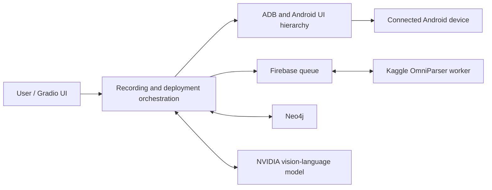

# VisionQA Agent

VisionQA Agent records Android UI workflows and reuses them as executable test cases. It controls a connected Android device through ADB, obtains UI information from Android's accessibility hierarchy or OmniParser, stores learned workflows in Neo4j, and uses an NVIDIA vision-language model when deterministic replay cannot safely continue.

The project does not require the source code of the Android application being tested.

## What the system provides

- Manual recording of taps, text input, swipes, long presses, and Back actions.
- Screenshot parsing through a Firebase-connected OmniParser worker.
- Graph storage of pages, elements, transitions, and high-level actions in Neo4j.
- Chain understanding and evolution for creating reusable task descriptions.
- Deterministic replay of exact and semantically related stored tasks.
- UI-layout-tolerant element matching based on labels, roles, and page structure.
- Bounded visual/ReAct recovery when stored knowledge is insufficient.
- Individual and multi-case execution with logs, status, timing, and a combined report.
- User assistance when an element cannot be recovered safely.

## Architecture



During deployment, task matching is performed before device capture. When a suitable stored task is found, the system replays its stored actions and uses live UI data to relocate the intended controls. Model reasoning is used for unresolved targets, non-stored portions of a task, and uncertain completion evidence.

## Main components

| Component | Responsibility |
|---|---|
| `main.py` | Starts FastAPI, Gradio, and the REST API on port 7860 |
| `ui.py` | Defines the six-tab user interface |
| `explor_human.py` | Records ADB actions and captures exploration screens |
| `OmniParser/client.py` | Submits screenshots to the Firebase OmniParser queue |
| `data/data_storage.py` | Saves exploration state and imports it into Neo4j |
| `data/graph_db.py` | Reads and writes graph data |
| `chain_understand.py` | Adds semantic reasoning to recorded transitions |
| `chain_evolve.py` | Produces richer page descriptions and high-level actions |
| `deployment.py` | Coordinates task matching, replay, fallback, and verification |
| `replay_engine.py` | Aligns screens and elements and executes stored plans |
| `deployment_hierarchy.py` | Reads Android UI hierarchy with OmniParser fallback |
| `deployment_report.py` | Streams individual and multi-case results to the UI |
| `nvidia_llm_bridge.py` | Calls the configured NVIDIA NIM model |
| `test_case/` | Automated unit and integration-style test modules |

## Requirements

- Windows, Linux, or macOS host; the current setup and commands below target Windows.
- Python 3.10 or newer; Python 3.11 is recommended.
- Android Platform Tools (`adb`).
- Android device or emulator with USB debugging enabled.
- Neo4j database.
- NVIDIA API key for model-assisted reasoning.
- Firebase Realtime Database and its service-account file for OmniParser requests.
- A running OmniParser worker, currently provided by `OmniParser/omniparser-queue.ipynb` in a Kaggle GPU environment.

The optional CPU feature service in `feature_service.py` is not required by the active deployment workflow.

## Installation

### 1. Create a Python environment

From the project directory in PowerShell:

```powershell
python -m venv .venv
.\.venv\Scripts\Activate.ps1
python -m pip install --upgrade pip
python -m pip install -r requirements.txt
```

If PowerShell blocks activation, use the environment's interpreter directly:

```powershell
& ".\.venv\Scripts\python.exe" -m pip install -r requirements.txt
```

### 2. Install and verify ADB

Install Android SDK Platform Tools, enable **Developer options** and **USB debugging** on the phone, and connect it with a data-capable USB cable.

```powershell
adb devices
```

The device must appear with the status `device`. If it shows `unauthorized`, unlock the phone and approve the debugging request.

### 3. Start Neo4j

Create or start a Neo4j database and retain its URI, database name, username, and password. A local URI commonly looks like:

```text
neo4j://127.0.0.1:7687
```

### 4. Configure environment variables

Create a `.env` file in the project root. Use your own values:

```dotenv
NEO4J_URI=neo4j://127.0.0.1:7687
NEO4J_USER=neo4j
NEO4J_PASSWORD=replace_with_your_password
NEO4J_DB=graphdb

NVIDIA_BASE_URL=https://integrate.api.nvidia.com/v1
NVIDIA_API_KEY=replace_with_your_nvidia_key
NVIDIA_MODEL=meta/llama-3.2-11b-vision-instruct
CHAIN_UNDERSTAND_MODEL=meta/llama-3.2-11b-vision-instruct
CHAIN_EVOLVE_MODEL=meta/llama-3.2-11b-vision-instruct

NVIDIA_REQUEST_TIMEOUT_SEC=200
NVIDIA_REASONING_EFFORT=medium
SCREENSHOT_SETTLE_SEC=2.0
```

Optional directories can be overridden with:

```dotenv
SCREENSHOT_DIR=./log/screenshots
JSON_STATE_DIR=./log/json_state
```

Never commit `.env`, API keys, database passwords, or Firebase service-account files. Rotate any credential that has previously been committed or shared.

### 5. Configure OmniParser

The current OmniParser client expects its Firebase Admin service-account file at:

```text
OmniParser/omniparser-queue-firebase-adminsdk-fbsvc-f46bd6f7ca.json
```

Use credentials belonging to your Firebase project. The local client uploads screenshots to Firebase, and the Kaggle worker reads each request and returns the labeled image and parsed element JSON.

To start the worker:

1. Upload `OmniParser/omniparser-queue.ipynb` to Kaggle.
2. Enable a GPU runtime.
3. Provide the same Firebase project credentials to the notebook.
4. Run all required cells.
5. Wait until the worker reports that it is waiting for tasks.
6. Keep the Kaggle session running while recording or executing tasks.

## Run the application

Start Neo4j and the Kaggle OmniParser worker first. Then run:

```powershell
python main.py
```

Open:

- Gradio interface: <http://127.0.0.1:7860/>
- REST API: <http://127.0.0.1:7860/api/>
- API documentation: <http://127.0.0.1:7860/docs>

## User workflow

### 1. Initialization

1. Open **Initialization**.
2. Refresh and select the ADB device.
3. Enter the application name and task description.
4. Select **Initialize**.

### 2. Exploration

1. Open **Exploration** and select **Start session**.
2. Wait for the initial screenshot and OmniParser labels.
3. Choose an action: tap, text, long press, short swipe, long swipe, or Back.
4. Supply the displayed element ID, text, or direction when required.
5. Select **Perform action** and verify the new labeled screen.
6. Repeat until the workflow is complete.
7. Select **Stop & save to JSON** and retain the generated state-file path.

Generated exploration data is written under:

```text
log/json_state/
log/screenshots/
labeled_image/img/
labeled_image/json_labeled_data/
```

### 3. Store to Neo4j

1. Open **Store to Neo4j**.
2. Paste the saved JSON state path.
3. Select **Store to databases**.
4. Confirm the success message.

The import creates graph entities for pages, elements, actions, and their relationships.

### 4. Chain processing

1. Open **Chain Processing**.
2. Enter the chain's start page ID.
3. Run `chain_understand` to analyze the recorded transitions.
4. Run `chain_evolve` to enrich descriptions and produce reusable task knowledge.
5. Use **Poll status** until the background job reports `Done` or `Error`.

Job state is held in memory. Restarting the application clears outstanding job records.

### 5. High-Level Execution

1. Open **High-Level Execution**.
2. Enter a natural-language task.
3. Select the connected device.
4. Select **Run high-level task**.
5. Follow matching, replay, recovery, and verification in the process log.
6. If the assistance dialog appears, answer its specific question or skip the task and record a new case.
7. Review the final outcome.

The execution policy is:

1. Match the requested task against stored actions.
2. Start the phone from Home and open the required application.
3. Align the live UI with stored screens and replay usable stored steps.
4. Recover moved or changed controls using hierarchy data, parsed labels, and bounded visual reasoning.
5. Use ReAct only for portions not safely covered by stored knowledge.
6. Verify the whole requested task before reporting success.
7. Return to Home and delete run-scoped screenshots and XML files after successful completion.

### 6. Stored Test Cases

The **Stored test cases** tab supports:

- Searching and refreshing stored cases.
- Running one selected case.
- Deleting a selected case and its related task data.
- Selecting multiple cases and running them sequentially.
- Viewing the currently executing case, detailed logs, per-case status, duration, outcome, and combined report.

Use one deployment at a time because all executions control the same selected Android device.

## Execution outcomes

| Outcome | Meaning |
|---|---|
| Passed / completed | The requested final state was confirmed |
| Failed / error | Execution encountered an unrecoverable problem |
| Skipped | The user chose to stop and add a new test case |
| Uncertain | The task may have finished, but available evidence was insufficient |
| Waiting for user | Execution is paused for a specific answer |

## Run tests

Run the complete test suite from the repository root:

```powershell
python -m unittest discover -s test_case -p "test_*.py" -v
```

Run one module, for example:

```powershell
python -m unittest test_case.test_chain_consistency -v
```

The latest recorded testing summary and known limitations are documented in [`test_case/TESTING_REPORT.md`](test_case/TESTING_REPORT.md). Tests primarily use mocks and fixtures; live Android, Firebase, Neo4j, and model behavior should also be verified in the target environment.

## Temporary public demonstration

The application can be exposed from the Windows host using a Cloudflare Quick Tunnel. The Android phone remains physically connected to and controlled by the host computer.

Start the application, then open a second PowerShell window:

```powershell
& "C:\Program Files (x86)\cloudflared\cloudflared.exe" tunnel `
    --protocol http2 `
    --url "http://127.0.0.1:7860"
```

Share the generated `trycloudflare.com` URL only with trusted users and stop the tunnel with `Ctrl+C` after the demonstration. Quick Tunnels are intended for temporary testing, and an unprotected URL can be opened by anyone who receives it.

## Troubleshooting

| Problem | Resolution |
|---|---|
| No device appears | Run `adb devices`, reconnect the cable, enable USB debugging, and approve the phone prompt |
| Device is `unauthorized` | Unlock the phone and accept the RSA authorization dialog |
| UI hierarchy capture fails | The system logs the accessibility failure and falls back to OmniParser |
| OmniParser waits or times out | Confirm the Kaggle worker and Firebase project are active and use matching credentials |
| Neo4j connection error | Start Neo4j and verify `NEO4J_URI`, credentials, and `NEO4J_DB` |
| NVIDIA request times out | Verify the API key, Internet connection, model name, and timeout setting |
| Stored cases are empty | Store an exploration chain and complete chain processing first |
| Deployment waits for user | Answer the specific assistance question or skip and record a new case |
| Public URL is slow | Confirm localhost is fast and use Cloudflare with `--protocol http2` |
| Port 7860 is occupied | Stop the conflicting process before starting `main.py` |

## Security and operational notes

- Do not expose ADB, Neo4j, Firebase credentials, or internal service ports publicly.
- Do not commit `.env` or Firebase Admin JSON files.
- A successful ADB command proves only that the command was sent; final task success requires UI evidence.
- Keep the phone unlocked and avoid manual interaction during automated execution.
- Keep Neo4j, Kaggle OmniParser, the application, and the device connection active for the duration of a run.
- Quick Tunnel URLs are temporary and change when the tunnel restarts.

## Additional documentation

- [`test_case/TESTING_REPORT.md`](test_case/TESTING_REPORT.md) — test strategy, results, and known failures.
- [`DEPLOYMENT_VERIFICATION.md`](DEPLOYMENT_VERIFICATION.md) — deployment implementation and verification details.
- [`DEPLOYMENT_STRATEGY_VERIFICATION.md`](DEPLOYMENT_STRATEGY_VERIFICATION.md) — replay and recovery strategy checks.
- [`CHAIN_UNDERSTAND_VERIFICATION.md`](CHAIN_UNDERSTAND_VERIFICATION.md) — chain-understanding compatibility and model configuration.
- [`data/CYPHER_QUERIES.md`](data/CYPHER_QUERIES.md) — useful Neo4j queries.
